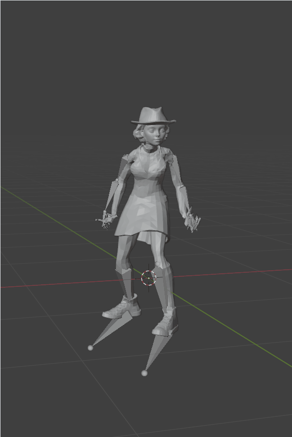
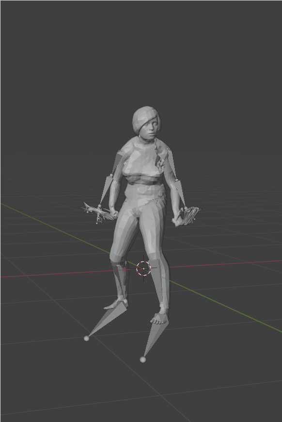

# Jittor 人体骨骼生成赛题






## 简介

本项目包含了第五届计图挑战赛计图 - 人体骨骼生成赛题的代码实现。项目采用了多尺度点云特征编码与门控融合机制，结合Point Transformer和Inception结构，实现了端到端的人体骨骼关节回归与顶点蒙皮权重预测。模型能够高效地从原始点云中提取多层次空间特征，并通过多分支骨骼预测器提升关节定位精度，在赛题测试集上取得了优异的效果。

## 安装 

本项目可在 2 张 4090 上运行，训练时间约为 8 小时。

#### 运行环境
- ubuntu 20.04 LTS
- python >= 3.7
- jittor >= 1.3.0

#### 安装依赖
执行以下命令安装 python 依赖
```
pip install -r requirements.txt
```

如需使用多卡加速训练，则需要执行如下命令安装mpi依赖

```
sudo apt install openmpi-bin openmpi-common libopenmpi-dev
```

关于mpi环境的具体配置可参考jittor官方文档[jittor.mpi](https://cg.cs.tsinghua.edu.cn/jittor/assets/docs/jittor.mpi.html)

#### 预训练模型

未使用预训练模型

## 数据预处理

未进行数据预处理

## 训练


在B榜下单卡训练可运行以下命令：

```
HARD=1 bash launch/train_combined5.sh
```

在B榜下双卡训练可运行以下命令：

```
HARD=1 bash launch/multigpu_train_combined5.sh
```

如需修改训练使用的显卡数目，可将`mpirun -np 2`中的2更改为对应的显卡数目

## 推理

生成测试集上的结果可以运行以下命令：

```
HARD=1 bash launch/predict_combined5.sh
```

## 致谢

此项目基于论文 *Point Transformer* 实现，Inception的构想参考了论文*Going deeper with convolutions*
